# 🏗️ AeroEarth Architecture (Visual Guide)

A visual top-down representation of how AeroEarth connects the 3D Web2 world (CesiumJS) with the Web3 Algorand TestNet Blockchain.

---

## 🧭 1. High-Level System Flowchart

```mermaid
flowchart TB
    User((User / Browser))
    
    subgraph Frontend["🖥️ Next.js + CesiumJS Frontend"]
        UI[3D Map Interface]
        Panel[Green Rewards Panel]
    end

    subgraph Backend["🛡️ Backend System"]
        API[API Proxy]
    end

    subgraph Blockchain["⛓️ Algorand TestNet"]
        AQI[(APP 1: AQI Registry)]
        Rewards[(APP 2: Green Rewards)]
    end

    %% Data flow mapping
    User -- Interaction & Viewing --> UI
    UI -- "1. Read Box Storage (No Auth)" --> AQI
    Panel -- "2. Read User Balance" --> Rewards
    
    UI -- "3. Submits Tree Placement" --> API
    API -- "4. Signs Txn via AlgoKit" --> Rewards
```

---

## 🔁 2. Detailed Data Sequence

```mermaid
sequenceDiagram
    participant User as 💻 User (Browser)
    participant Cesium as 🌍 3D Globe (CesiumJS)
    participant API as 🛡️ Wallet Proxy (/api)
    participant Algod as 📡 Algorand Node
    participant AQI as 🟢 AQI Registry Contract
    participant Rewards as 🏆 Green Rewards Contract

    %% Map Loading Flow
    Note over User, Algod: 🌊 Flow 1: Loading Map Data (Decentralized Read)
    User->>Cesium: Opens AeroEarth
    Cesium->>Algod: GET /v2/applications/{AQI_ID}/boxes
    Algod-->>Cesium: Base64 JSON (Lat, Lng, AQI)
    Cesium->>User: Renders 3D Heatmap overlay

    %% Action Flow
    Note over User, Rewards: 🌱 Flow 2: Planting a Tree (Verifiable Action)
    User->>Cesium: Clicks map to plant tree
    Cesium->>API: POST /api/tree {coords, CO2_offset}
    
    API->>API: Mnemonic signs transaction locally
    
    API->>Algod: Submit Signed Transaction
    Algod->>Rewards: recordAction(User_Address, Points)
    Rewards-->>Algod: State + Box Storage Updated!
    
    Algod-->>Cesium: Rewards Panel auto-polls new balance
    Cesium->>User: 🎉 Live Points Balance Increased!
```

---

## 🏛️ 2. Core Components

### 🖥️ Frontend (Web2)
- **Engine:** Next.js + React
- **Graphics:** CesiumJS Engine
- **Role:** Handles 60FPS rendering of 3D tiles and map interaction. Reads global state directly from Algorand APIs without any centralized backend.

### 🛡️ Backend Proxy
- **Engine:** Next.js Serverless Function
- **Role:** securely houses the `DEPLOYER_MNEMONIC`. Signs "Tree Planting" transactions on the user's behalf so nobody has to connect a Web3 wallet just to try the demo.

### ⛓️ Blockchain (Web3)
- **Network:** Algorand TestNet
- **Language:** TypeScript compiled to AVM via PuyaTs

---

## 🗄️ 3. Box Storage Structure

Because traditional mapping platforms require large PostgreSQL databases, we moved the data structure directly into Algorand Box Storage for O(1) instant read-access globally.

### App 1: `AQI Registry`
Provides the immutable oracle data that generates the 3D heatmap.

### App 2: `Green Rewards Ledger`
Provides the un-cheatable points system for user mitigation actions.

---

## ⚡ 4. The "Why Algorand?" Trade-Off Matrix

| Traditional Web2 Stack | Why AeroEarth Uses Algorand Instead |
| :--- | :--- |
| **Centralized Database** (PostgreSQL/MongoDB) | **Direct Box Reads:** Frontend queries the Algod node directly. If our API server crashes, the map and user balances remain fully functional and publicly verifiable. |
| **Server-side Calculation** | **On-Chain Truth:** The math (awarding points) is executed on the AVM. Once the transaction processes, nobody—not even the site admins—can secretly alter user balances. |
| **High Server Costs** | **Cheap Transactions:** Heavy data is stored in isolated Box Storage. We pay a one-time minimum balance requirement (MBR) per box instead of monthly AWS RDS hosting fees. |
| **Energy Consumption** | **Carbon Negative:** It's counter-intuitive to build an eco-dApp on an energy-hungry network. Algorand's PPoS consensus ensures the blockchain actually stays green. |
