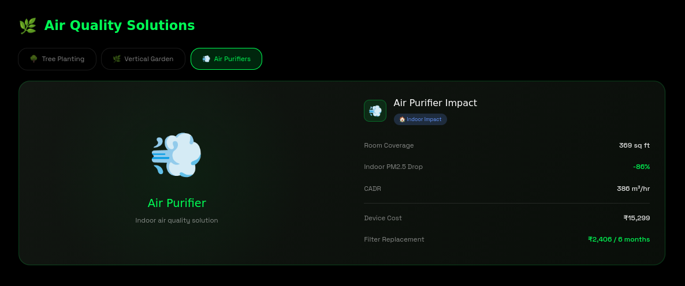
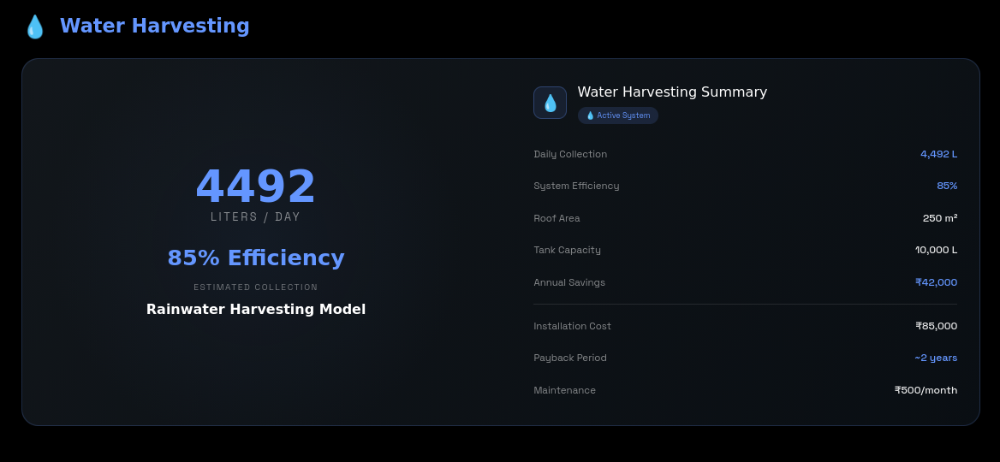
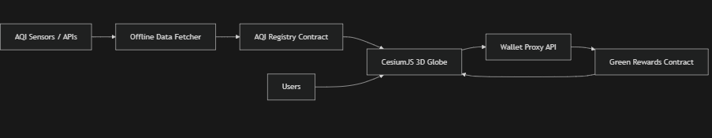

<h2 align="center">
  
</h2>

<p align="center">
  
</p>


<p align="center">
  
  
  
  
  


  
  
  
  
  
</p>

## ✨ Demo

`AeroChain` Decentralized platform that connects atmospheric intelligence with Earth-scale visualization using blockchain:

<!-- 🌍 Main Demo Image Full Width -->
<p align="center">
  
</p>

<!-- ☀️ Solar & 💧 Water Full Width Side by Side -->
<p align="center">
  
  
</p>

<!-- 🌫️ AQI Section Full Width -->
<p align="center">
  
</p>


<h2 align="center">The Problem We're Solving</h2>

<p align="center">
  
  
</p>

<br/>

Right now, climate action suffers from two massive problems: **lack of transparency** and **lack of engagement**. 

People and companies claim to plant trees or reduce emissions, but how do we *prove* it? And for the everyday user, environmental dashboards are just boring spreadsheets. 

AeroEarth fixes both:
1. **Gamified Action:** We turn climate awareness into an immersive 3D experience using CesiumJS.
2. **Absolute Proof:** By storing both the starting pollution data and the user's mitigation actions (carbon offsets) on-chain, we create a transparent, tamper-proof record of who is actually helping the planet.


<h2 align="center">
  
</h2>
AeroEarth addresses the core challenges of climate action by combining engagement with verifiable accountability.


<p align="center">
  
  
  
</p>

<p align="center">
  
</p>

<p align="center">
  
</p>

<br/>


1. **Gamified Climate Action:**  
   We transform climate awareness into an immersive 3D Earth experience powered by CesiumJS. Instead of static dashboards, users interact with real-world environmental data in a dynamic and intuitive way.
   

2. **On-Chain Transparency:**  
   Both the baseline pollution data and user mitigation actions are stored on-chain. This creates a transparent, tamper-proof, and publicly verifiable record of measurable climate impact.

<br/>


<br/>

<p align="center">
  
</p>


<h2 align="center"> Why We Chose Algorand</h2>


<!-- Animated Subheading -->
<p align="center">
  
</p>

<ul>
  <li><b> Carbon Negative & Fast:</b> Carbon-negative blockchain with sub-3-second finality. Building an eco dApp on an energy-hungry chain makes zero sense.</li>
  <li><b> Ultra-Low Transaction Fees:</b> ~0.001 ALGO per transaction — perfect for logging thousands of environmental actions.</li>
  <li><b> Box Storage (BoxMap):</b> Unlimited on-chain map storage with O(1) read access. No centralized database required.</li>
  <li><b> TypeScript Smart Contracts (PuyaTs):</b> Smart contracts written fully in TypeScript, compiled directly into AVM bytecode via AlgoKit.</li>
</ul>

<!-- Footer Wave -->
<p align="center">
  
</p>

## 🔗 Live Links & Demo
- **Live Demo URL:** [Insert Vercel/Netlify Link Here]
- **Pitch / Demo Video:** [Insert LinkedIn Post URL Here]

---

# Architecture

<p align="center">
  
</p
<p align="center">
  
</p

<p align="center">
  
</p


## 🛠 Tech Stack
- **Blockchain:** Algorand (AVM), Algorand TypeScript, PuyaTs
- **Developer Tooling:** AlgoKit, Lora Explorer, `@algorandfoundation/algokit-utils`
- **Frontend Engine:** Next.js 15, React, CesiumJS (3D Globe)
- **Styling:** TailwindCSS
- **Backend:** Next.js API Routes (Server-side proxy for signing admin transactions)

---

## 💻 Installation & Local Setup

Want to run AeroEarth yourself? Here’s how:

### 1. Prerequisites
- Node.js (v18+)
- Docker Desktop (required to run the local blockchain)
- [AlgoKit CLI](https://developer.algorand.org/docs/get-started/algokit/) 

### 2. Spin up the Blockchain
```bash
# Start your local Algorand node
algokit localnet start
```

### 3. Deploy the Smart Contracts
```bash
git clone [repo-url]
cd [repo-directory]/blockchain

# Deploy the AQI Registry & seed the initial map data
npm install
npm run reset       

# Deploy the Green Rewards ledger
cd green-rewards
npm install
npm run deploy      
```

### 4. Boot the 3D Frontend
```bash
cd ../air2earth-chain

# Set up your environment variables
cp .env.example .env.local 

# Install and run
npm install
npm run dev
```
Open up `http://localhost:3000` and start saving the planet!

---


## ⚠️ Known Limitations & Future Roadmap
- **Network Dependency:** The current repo is configured for LocalNet for easy judging/testing. To run on TestNet, update the `NEXT_PUBLIC_ALGOD_SERVER` in your `.env`.
- **Hardware Profile:** Rendering 3D maps and high-res heatmaps via Cesium is GPU-intensive. It might stutter on older laptops.
- **Roadmap - Web3 Wallets:** Right now, the system tracks sessions and proxy addresses. Next up is native Pera Wallet / Defly integration so users hold their Green Points directly in their own wallets.

---

## 🤝 The Team

- **[@SudharshanAIML](https://github.com/SudharshanAIML)** – 3D Modeling & Animations  
  _3D Models, Visualization, Animations_

- **[@ThiruEigen7](https://github.com/ThiruEigen7)** – Frontend Developer & UI/UX Engineer  
  _Next.js, React, UI/UX Design, CesiumJS Integration_

- **[@call-meRavi-SHORT-CODE](https://github.com/call-meRavi-SHORT-CODE)** – AI/ML Engineer  
  _LSTM Models, Heatmap Generation, Environmental Analytics_

- **[@Shashanth27](https://github.com/Shashanth27)** – Blockchain Engineer  
  _Algorand Smart Contracts, AlgoKit, Web3 Infrastructure_
